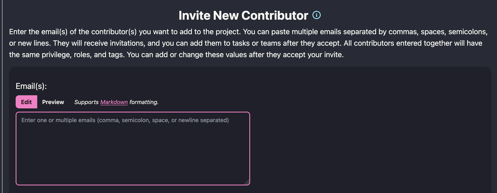

## **🚀 Invite Multiple Contributors!**

We’ve just rolled out a set of updates that make it easier than ever to bring collaborators into your STAPLE projects. Whether you’re coordinating a large research team or onboarding a few new contributors, these changes are designed to save time and reduce friction.

### **👥 Invite Multiple Contributors at Once**

You can now invite **multiple people to your project in one go**. Just paste a list of emails—separated by commas, spaces, or new lines—and STAPLE will send out all the invitations automatically. No more repeating the form for each person!

After sending, you’ll get a single confirmation summarizing who was successfully invited and if any addresses couldn’t be processed. This makes it easy to double-check everyone got their invitation.

### **📝 Smarter Email Input**

We’ve replaced the old single-line email box with a **multiline text area** so you can paste in long lists of addresses comfortably. You can hit Enter to start a new line, and STAPLE will handle the rest—splitting, validating, and inviting each address individually.

### Enjoy!
